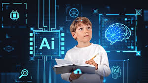

# <Ins>Influencia de las IAs en el aprendizaje humano

> CURSO DAM 25-26

## *Ivan Gutierrez*

### Aspectos Positivos ✅

* *Acceso rápido al conocimiento:
La **IA** permite obtener información de forma inmediata y personalizada.*

* *Aprendizaje personalizado:
Plataformas con IA adaptan los contenidos al ritmo, estilo y nivel de cada estudiante.*

* *Asistencia 24/7:
Herramientas como chatbots educativos están disponibles en cualquier momento.*

* *Automatización de tareas repetitivas:
Libera tiempo de docentes y alumnos para centrarse en actividades más complejas.*

* *Estimulación del **pensamiento crítico**:
Al interactuar con sistemas de IA, los estudiantes pueden desarrollar habilidades de análisis y evaluación de información.*

### Aspectos Negativos ❌

* *Dependencia tecnológica:
Puede reducir la iniciativa y el esfuerzo cognitivo si se usa en exceso.*

* *Pérdida de habilidades básicas:
Delegar demasiado en la IA puede afectar habilidades como la escritura, el cálculo o la memoria.*

* *Desinformación o respuestas erróneas:
La IA no siempre es precisa y puede generar contenido incorrecto si no se verifica.*

* *Desigualdad de acceso:
No todos los estudiantes tienen los mismos recursos tecnológicos.*

* *Privacidad y ética:
El uso de datos personales por sistemas de IA plantea preocupaciones éticas.*

### 📊 Impacto en el análisis de datos y el seguimiento del aprendizaje

***Sistemas de análisis predictivo:***
*Los sistemas de IA pueden analizar las tendencias de los 
estudiantes y hacer predicciones sobre su rendimiento.
Esto puede ayudar a los educadores a tomar decisiones informadas
sobre qué métodos de enseñanza son más efectivos.*

***Educación basada en datos:***
*A medida que se recopilan más datos sobre el progreso y las necesidades de los estudiantes,
los sistemas educativos pueden adaptarse en tiempo real para satisfacer mejor las demandas del alumno. Este enfoque permite una educación más dinámica y centrada en el estudiante.*

### <ins>Resumen

**La *IA* transforma la forma en que aprendemos, facilitando el acceso al conocimiento y personalizando la educación,
pero también exige un uso crítico y responsable para evitar la ~~dependencia~~ y asegurar un desarrollo integral del aprendizaje humano.**

[prueba.py](prueba.py)

| Aspectos | uso de ia | sin uso de ia |
|----------|-----------|---------------|
|Personalización del Aprendizaje|IA ajusta el contenido según el nivel, estilo y ritmo del estudiante.|El aprendizaje es más uniforme y generalmente sigue un ritmo fijo para todos.|
|Acceso a Recursos|Acceso inmediato a materiales de aprendizaje, recursos interactivos y tutoriales personalizados.|Depende de la disponibilidad de recursos físicos o materiales educativos convencionales.
|Asistencia en Tiempo Real|Herramientas como chatbots o tutores virtuales proporcionan ayuda 24/7.|La asistencia solo está disponible durante las horas de clase o en momentos específicos.|
|Interactividad y Participación|Herramientas interactivas, simulaciones y juegos educativos que aumentan la participación.|Aprendizaje tradicional más centrado en la lectura, la escritura y la clase magistral.|
