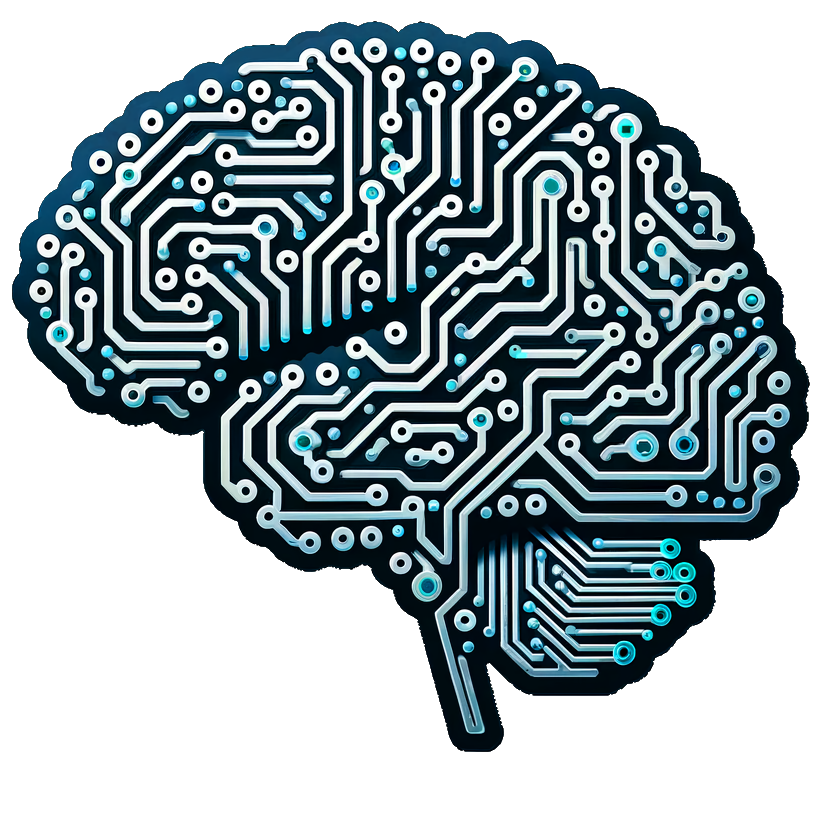

# <Ins>Influencia de las IAs en el aprendizaje humano

> CURSO DAM 25-26

## *Ivan Gutierrez*

### Aspectos Positivos ✅

* *Acceso rápido al conocimiento:
La **IA** permite obtener información de forma inmediata y personalizada.*

* *Aprendizaje personalizado:
Plataformas con IA adaptan los contenidos al ritmo, estilo y nivel de cada estudiante.*

* *Asistencia 24/7:
Herramientas como chatbots educativos están disponibles en cualquier momento.*

* *Automatización de tareas repetitivas:
Libera tiempo de docentes y alumnos para centrarse en actividades más complejas.*

* *Estimulación del **pensamiento crítico**:
Al interactuar con sistemas de IA, los estudiantes pueden desarrollar habilidades de análisis y evaluación de información.*

### Aspectos Negativos ❌

* *Dependencia tecnológica:
Puede reducir la iniciativa y el esfuerzo cognitivo si se usa en exceso.*

* *Pérdida de habilidades básicas:
Delegar demasiado en la IA puede afectar habilidades como la escritura, el cálculo o la memoria.*

* *Desinformación o respuestas erróneas:
La IA no siempre es precisa y puede generar contenido incorrecto si no se verifica.*

* *Desigualdad de acceso:
No todos los estudiantes tienen los mismos recursos tecnológicos.*

* *Privacidad y ética:
El uso de datos personales por sistemas de IA plantea preocupaciones éticas.*

